## 支持向量机（SVM）

支持向量机（Support Vector Machine，SVM）属于**有监督学习模型**，主要用于**解决数据分类问题**。通常SVM用于二元分类问题，对于多元分类可将其分解为多个二元分类问题，再进行分类，主要应用场景有图像分类、文本分类、面部识别和垃圾邮件检测等领域。

以一个二元分类问题为例讲解模型原理。首先假设有两类数据，如图需要找出一条边界来将两类数据分隔开来。

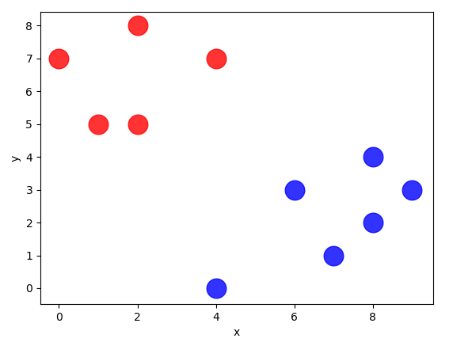

下图中列出一些可行的分隔方式。在当前的数据集的条件下，三种分隔方式都是可行的，我们该如何做选择？

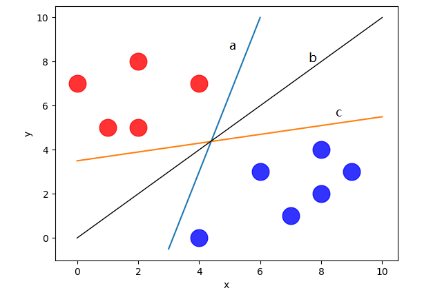

一般说来，需要选择的是具有**较强分类能力的直线**，**有较稳定的分类结果**和**较强的抗噪能力**，比如在数据集扩展之后如下图所示。在这三种分隔方式中，b的分隔效果更好。

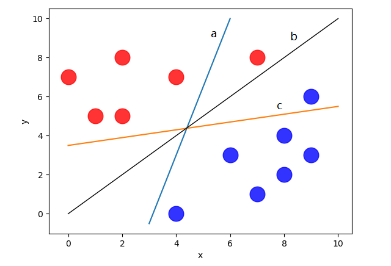

找到最优分类数据的分界线，使得对样本数据的分类效果更好的方法就是要**尽可能地远离两类数据点**，即数据集的边缘点到分界线的距离d最大，这里虚线穿过的边缘点称作支持向量，分类间隔为2d。如下图所示。

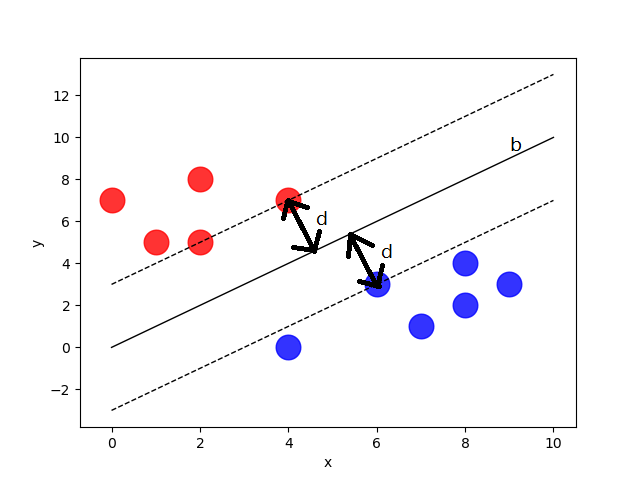

在二维平面上，最优分界线：b

如何将二维分类问题拓展到三维，甚至更高维的空间中呢？

为了不失一般性，我们把最优分界线称分离超平面，用 分离超平面来划分高维空间中的数据集。

SVM是从线性可分情况下的最优分类面发展而来的。

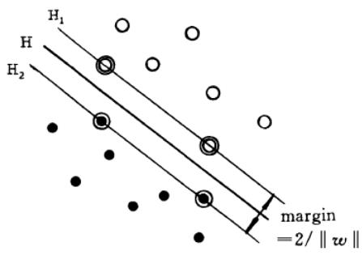

支持向量：

在线性可分情况下，训练数据集的样本点中与分离超平面距离最近的样本点的实例称为支持向量。支持向量是使约束条件成立的点。即在$H_1$和$H_2$上的点就是支持向量。

间隔和间隔边界：

$H_1$和$H_2$之间的距离就是间隔，间隔等于$\frac{2}{||w||}$，$H_1$和$H_2$称为间隔边界。

分类超平面：即 H

### 1.线性可分支持向量机（硬间隔支持向量机）

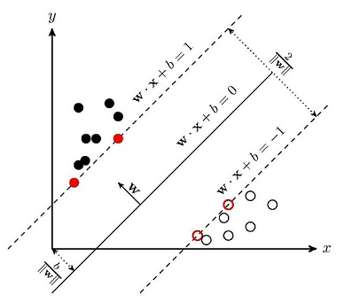

• 分类超平面：$(w \cdot x)+b = 0$，其中w是法向量
		• 判决函数：$y_i=sgn({w} \cdot x+{b}) \quad  y_i \in \{-1,1\}$ 
		• 最大间隔问题：在间隔固定为1时，寻求最小的 ‖w‖支持向量

#### 函数间隔和几何间隔

##### 函数间隔：

对于给定的训练数据集T和超平面（w,  b），定义超平面（w，b）关于样本点（$x_i, y_i$) 的函数间隔为
$$
\hat{\gamma_i}=y_i(w\cdot x_i+b)
$$
函数间隔最小值：$\hat{\gamma}=\min_{i=1,...,N}{\hat{\gamma_i}}$

函数间隔可以表示分类预测的正确性和确信度，但是成比例改变w和b时，如2w和2b，超平面没有改变，函数间隔却扩大了2倍，这时可以对分离超平面的法向量w加入某些约束，如规范化，$\begin{Vmatrix}w\end{Vmatrix}=1$, 使得间隔是确定的，这时函数间隔就成为几何间隔。

##### 几何间隔：

对于给定的训练数据集T和超平面（w,  b），定义超平面（w，b）关于样本点（$x_i, y_i$) 的几何间隔为
$$
\gamma_{i}=y_i(\frac{w}{||w||}x_i+\frac{b}{||w||})
$$
几何间隔最小值：$\gamma=\min_{i=1,...,N}{\gamma_i}$

函数间隔和几何间隔的关系：

$$
\gamma_{i}=\frac{\hat{\gamma_i}}{||w||}
\\
\gamma=\frac{\hat{\gamma}}{||w||}
$$
如果$||w||=1$， 那么函数间隔和几何间隔相等。如果超平面参数w和b成比例的改变（超平面没有改变），函数间隔也因此比例改变，而几何间隔不变。

#### 最大间隔法

支持向量机学习的基本想法是求解能够正确划分训练数据集并且几何间隔最大的分离超平面。对于线性可分的训练集而言，它的分离超平面有无穷多个，但几何间隔最大的分离超平面是唯一的。这里的间隔最大化又称硬间隔最大化。

对训练数据集找到几何间隔最大的超平面意味着以充分大的确信度对训练集进行分类。不仅将正负实例点分开，而且对最难分的实例点（离超平面最近的点）也有足够大的确信度将它们分开。这样的超平面对未知的新实例有很好的分类预测能力。

间隔最大化（硬间隔最大化）：选择正确分类线性可分的训练数据集中的硬间隔最大的一个分离超平面，这个分离超平面存在且唯一。那么将该问题建模为如下的约束最优化问题： 
$$
\max_{w,b} \gamma
\\
s.t. \quad  y_i(\frac{w}{||w||}x_i+\frac{b}{||w||}) \geq \gamma，i=1,2,...,N
$$
如下图所示，其中间隔边界为$wx+b=1$和$wx+b=-1$，这两个间隔平面的中间平面为分离超平面$wx+b=0$，其中间隔最大表示为$\frac{2}{||w||}$。 

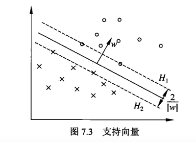

在间隔固定为1时，寻求最小的$\begin{Vmatrix}w\end{Vmatrix}$

因为最优化目标就是最大化几何间隔，并且几何间隔与$\begin{Vmatrix}w\end{Vmatrix}$成反比，因此只需寻找最小的$\begin{Vmatrix}w\end{Vmatrix}$，即$\min\begin{Vmatrix}w\end{Vmatrix}$

可以用一个等价的函数代替 :  $\frac{1}{2}min\begin{Vmatrix}w\end{Vmatrix}^2$

可以将上述问题转换为如下最优化问题，最大化$\frac{2}{||w||}$，相当于最小化$\frac{1}{2}{||w||}^2$：
$$
\min_{w,b} \frac{1}{2}{||w||}^2
\\
s.t. \quad  y_i(wx_i+b)-1 \geq 0, i=1,2,...,N
$$
从而转换为求解凸二次规划问题，这里参考拉格朗日乘子法和KKT条件，用来求解约束条件下的最优化问题。

##### 最大间隔法：

输入：线性可分训练数据集$T=\{(x_1,y_1),(x_2,y_2),...,(x_n,y_n)\}$，其中，$x_i\in\chi=R^n$，$y_i\in Y=\{-1,+1\}$，$i=1,2,...,N$

输出：最大间隔分离超平面和分类决策函数

构造并求解约束最优化问题：

$$
\min_{w,b} \frac{1}{2}{||w||}^2\\ s.t.  \quad  y_i(wx_i+b)-1 \geq 0, i=1,2,...,N
$$
 求得最优解${w}^*$，$(b)^*$

由此得到分离超平面：

$$
{w}^*x+{b}^*=0
$$
和分类决策函数: 
$$
f(x)=sgn({w}^*x+{b}^*)
$$

#### 优化问题

$$
min\frac{1}{2}\begin{Vmatrix}w\end{Vmatrix}^2\\
s.t. \quad y_i[(w*x_i)+b]-1\geq0 \quad (i=1,2,…n)\\
$$

为解决这个约束问题的最优解，引入拉格朗日函数（lagrange):
$$
L(w,b,\alpha)=\frac{1}{2}\begin{Vmatrix}w\end{Vmatrix}^2-\sum_{i=1}^n{\alpha_i[y_i(w*x_i+b)-1]}
$$
其中 $\alpha\geq0$为拉格朗日乘子。为求函数最小值，分别对w、b、$\alpha_i$求偏微：
$$
\begin{cases} 
\frac{\partial L}{\partial w}=0 \quad \Rightarrow \quad w=\sum_{i=1}^n{\alpha_iy_ix_i} \\
\\
\frac{\partial L}{\partial b }=0 \quad \Rightarrow \quad \sum_{i=1}^n{\alpha_iy_i} =0\\
\\
\frac{\partial L}{\partial \alpha_i}=0 \Rightarrow \quad \alpha_i[y_i(w*x_i+b)-1]=0 \\
\end{cases}
$$
可以将上述求最优平面问题转化为对偶问题

#### 对偶问题

$$
\begin{cases} 
\max\sum_{i=1}^n{\alpha_i}-\frac{1}{2}\sum_{i=1}^n\sum_{j=1}^n{\alpha_i\alpha_jy_iy_j(x_i \cdot x_j)} \\
\\
s.t. \quad \alpha_i \geq0,\quad i=1,2,...,n\\
\\
\sum_{i=1}^n{\alpha_iy_i}=0 \\
\end{cases}
$$

这是一个二次函数寻优的问题，存在唯一解。

若$a^*$为最优解，
$$
w^*=\sum_{i=1}^n{\alpha_i^*y_ix_i}
$$
式中$a_i^*$为不为零的样本，即支持向量。$b^*$是分类阈值，
$$
b^*=y_j-\sum_{i=1}^N{\alpha_i^*y_i(x_i\cdot x_j)}
$$
求得分离超平面：
$$
w^**x+b^*=0
$$
得到分类决策函数：
$$
f(x)=sng\{(w^**x)+b^*\}=sng\{\sum_{i=1}^n{\alpha_i^*y_i(x_i \cdot x)+b^*}\}
$$

### 2.线性支持向量机（软间隔支持向量机）

数据集中有一些特异点，造成了线性不可分的情况，这种情况可以引进松弛变量来解决。

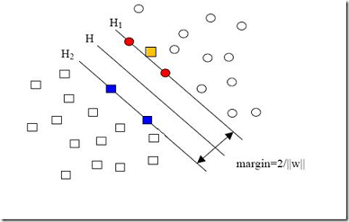

#### 松弛变量 $\xi$ 和 惩罚参数 C

对每个样本点 $(x_i,y_i)$ 引进一个松弛变量 $\xi_i\geq0$，使函数间隔加上松弛变量大于等于1，约束条件变为
$$
y_i(w\cdot x_i+b)\geq1-\xi_i
$$

同时，对每个松弛变量$\xi_i$，支付一个代价$\xi_i$. 目标函数由原来的 $\frac{1}{2}\begin{Vmatrix}w\end{Vmatrix}^2$ 变成
$$
\frac{1}{2}\begin{Vmatrix}w\end{Vmatrix}^2+C\sum_{i=1}^N\xi_i
$$
这里， $C\gt0$ 称为惩罚参数。C值大时对误分类的惩罚增大，反之减小。

最小化目标函数包含两层含义：使 $\frac{1}{2}\begin{Vmatrix}w\end{Vmatrix}^2 $ 尽量小即间隔尽量大，同时使误分类的点的个数尽量小。C是调和二者的系数。

由此可得，线性不可分的线性支持向量机的**原始问题**：
$$
\min_{w,b,\xi} \quad  \frac{1}{2}\begin{Vmatrix}w\end{Vmatrix}^2 +C\sum_{i=1}^N\xi_i\\
\\
s.t. \quad y_i[(w\cdot x_i)+b]\geq1-\xi_i,  \quad (i=1,2,…N)\\
\\
\xi_i\geq0, \quad (i=1,2,…N)
$$
w的解是唯一的，但b的解不唯一，b的解存在于一个区间。

#### 线性支持向量机定义

对于给定的线性不可分的训练数据集，通过求解软间隔最大化问题(上式)，得到的分离超平面为
$$
w^*\cdot x+b^*=0
$$
分类决策函数为
$$
f(x)=sng(w^*\cdot x+b^*)
$$
线性支持向量机包含线性可分支持向量机。

#### 对偶问题

**原始问题的对偶问题**是
$$
\min \frac{1}{2}\sum_{i=1}^N \sum_{j=1}^N\alpha_i\alpha_jy_iy_j(x_i \cdot x_j)- \sum_{i=1}^N \alpha_i
\\
s.t. \quad \sum_{i=1}^N \alpha_iy_i=0
\\
0 \leq \alpha_i \leq C, \quad i=1,2,...,N
$$

对偶问题的求解过程：

原始最优化问题的拉格朗日函数是
$$
L(w,b,\xi,\alpha,\mu)= \frac{1}{2}||w||^2+C\sum_{i=1}^N\xi_i - \sum_{i=1}^N \alpha_i(y_i(w \cdot x_i+b)-1+\xi_i)-\sum_{i=1}^N \mu_i\xi_i
\\
其中，\alpha_i\geq 0, \mu_i \geq0
$$
对偶问题即是拉格朗日函数的极大极小问题。求得对偶问题是：
$$
\max_\alpha \quad  -\frac{1}{2}\sum_{i=1}^N\sum_{j=1}^N \alpha_i\alpha_jy_iy_j(x_i \cdot x_j)+ \sum_{i=1}^N \alpha_i
\\
\begin{aligned}
&s.t. \quad \quad \sum_{i=1}^N \alpha_iy_i=0 
\\
& C-\alpha_i-\mu_i =0 
\\
&\alpha_i\geq0
\\
&\mu_i\geq0, \quad i=1,2,...,N
\end{aligned}
$$

将约束条件变为 $0 \leq \alpha_i \leq C$ , 再将对目标函数求极大转换为求极小，于是得到原始问题的对偶问题。

#### 求解 $w^*, b^*$

设 $\alpha^*=(\alpha_1,\alpha_2,...,\alpha_N)^T$ 是对偶问题的一个解，若存在 $\alpha^*$ 的一个分量 $\alpha_j^*，   0\lt \alpha_j^* \lt C$ , 则原始问题的解 $w^*, b^*$ 可按下式求得：
$$
w^*=\sum_{i=1}^N \alpha_i^* y_i x_i
\\
b^*= y_i- \sum_{i=1}^N y_i \alpha_i^*(x_i \cdot x_j)
$$
 选择 $\alpha^*$ 的一个分量 $\alpha_j^*$ 适合条件 $0\lt \alpha_j^* \lt C$ , 计算 $b^*$

由于原始问题对b的解并不唯一，所以实际计算时可以取在所有符合条件的样本点上的平均值。

#### 求分离超平面和分类决策函数

由此可知，分离超平面为：
$$
w^*\cdot x+b^*=\sum_{i=1}^N \alpha_i^* y_i( x \cdot x_i) + b^* =0
$$
分类决策函数为：
$$
f(x)=sng(w^*\cdot x+b^*)=sng \{ \sum_{i=1}^N \alpha_i^* y_i (x \cdot x_i)+b^*\}
$$

#### 支持向量

在线性不可分的情况下，将对偶问题的解 $\alpha^*=(\alpha_1,\alpha_2,...,\alpha_N)^T$ 中对应于 $\alpha_i^*\gt0$ 的样本点 $(x_i,y_i)$ 的实例 $x_i$ 称为支持向量（软间隔的支持向量）。如下图：

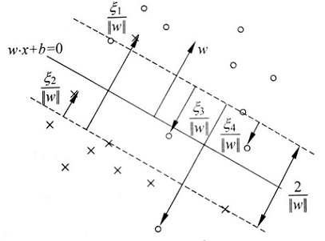

软间隔的支持向量 $x_i$ 或者在间隔边界线上，或者在间隔边界线与分离超平面之间，或者在分离超平面误分的一侧。

若 $\alpha_i^*\lt0$ ，则 $\xi_i=0$ ，支持向量 $x_i$ 恰好落在间隔边界线上；

若 $\alpha_i^*=0$ ， $0\lt \xi_i\lt1$ ，则分类正确， $x_i$ 在间隔边界线与分离超平面之间；

若 $\alpha_i^*=C$ ， $\xi_i=1$ ，则 $x_i$ 在分离超平面上；

若 $\alpha_i^*=C$ ， $\xi_i\gt 1$ ，则 $x_i$ 在分离超平面误分的那一侧。

### 3.非线性支持向量机

对于非线性分类问题，我们可以使用核技巧（kernel trick）。

通过名为核函数的特征变换，增加新的特征，使得低维度空间中的线性不可分问题变为高维度空间中的线性可分问题。

#### 核技巧

##### 1.  非线性分类问题

一般来说，对于给定的一个训练数据集 $T = \{(x_1,y_1),(x_2,y_2),...,(x_N,y_N)\}$ ，其中，实例 $x_i$ 属于输入空间， $x_i= R^n$ , 对应的标记有两类 $y_i=\{-1,1\}，i=1,2，...，N$ , 如果能用 $R^n$ 中的一个超曲面将正负例正确分开，则称这个问题是**非线性可分问题**。

我们可以通过**映射**将非线性分类问题转换为线性分类问题。

设原空间为 $X\subset R^2，x=(x^{(1)}，x^{(2)})^T \in X$ ， 新空间为 $Z \subset R^2, z=(z^{(1)}，z^{(2)})^T \in Z$ , 定义从原空间到新空间的变换（映射）：
$$
z=\phi(x) = ((x^{(1)})^2，(x^{(2)})^2)
$$
经过变换 $z=\phi(x) $ , 原空间 $X \subset R^2$ 变换为新空间 $Z \subset R^2$ ，原空间中的点相应地变换为新空间中的点，原空间中的椭圆
$$
w_1(x^{(1)})^2+w_2(x^{(2)})^2+b=0
$$

变换为新空间中的直线
$$
w_1z^{(1)}+w_2z^{(2)}+b=0
$$
在变换后的新空间里，直线 $w_1z^{(1)}+w_2z^{(2)}+b=0$ 可以将变换后的正负实例点正确分开。这样，原空间的非线性可分问题就变成了新空间的线性可分问题。

##### 2.核函数的定义

设X 是输入空间（欧式空间 $R^n$ 的子集或离散集合），又设H 为特征空间（希尔伯特空间），如果存在一个从 X 到 H 的映射，
$$
\phi(x): X \to H
$$
使得对所有 $x,z \in X$ , 函数 $K(x,z)$ 满足条件
$$
K(x,z)=\phi(x) \cdot\phi(z)
$$
则称 $K(x,z)$ 为核函数， $\phi(x)$ 为映射函数，式中 $\phi(x) \cdot\phi(z)$ 为 $\phi(x)$ 和 $\phi(z)$ 的内积。

注意， $\phi$ 是输入空间 $R^n$ 到特征空间 $H$ 的映射，特征空间 H 一般是高维的，甚至是无穷的。因此，对于给定的核 $K(x,z)$ , 特征空间H和映射函数 $\phi$ 的取法并不唯一。

##### 3.核技巧在支持向量机中的应用

在对偶问题的目标函数中的内积 $x_i\cdot x_j$ ， 可以用核函数 $K(x_i,x_j)=\phi(x_i) \cdot\phi(x_j)$ 来代替, 此时对偶问题的目标函数为

$$
W(\alpha) = \frac{1}{2}\sum_{i=1}^N \sum_{j=1}^N \alpha_i \alpha_j y_i y_j K(x_i,x_j)-\sum_{i=1}^N \alpha_i
$$
同样，分类决策函数中的内积也可以用核函数代替，而决策分类函数式为
$$
f(x)=sng\{\sum_{i=1}^N \alpha_i^* y_i \phi(x_i) \cdot \phi(x)+b^*\}=sng\{\sum_{i=1}^N \alpha_i^* y_i K(x_i,x_)+b^*\}
$$
这等价于经过映射函数 $\phi $ 将原来的输入空间变换到一个新的特征空间，将输入空间中的内积 $x_i\cdot x_j$ 变换为特征空间中的内积 $\phi(x_i) \cdot \phi(x_j)$ ，在新的特征空间里从训练样本中学习线性支持向量机。在核函数K给定的条件下，学习是隐式地在特征空间进行的，不需要显式地定义特征空间和映射函数，这样的技巧就是核技巧。

### 常用的核函数

线性核函数 

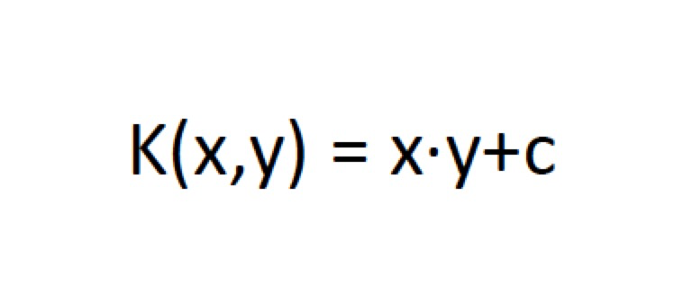

多项式核函数

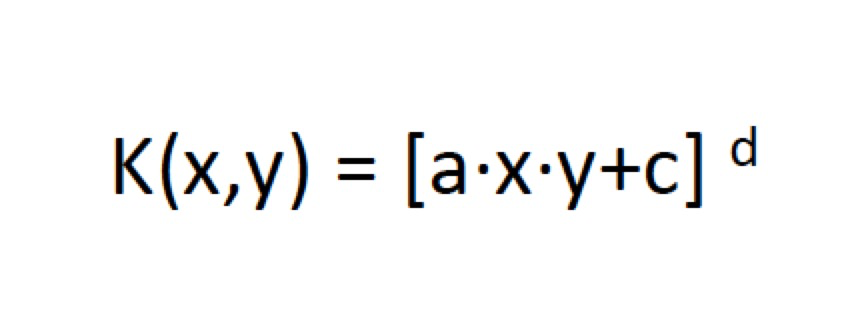

径向基核函数

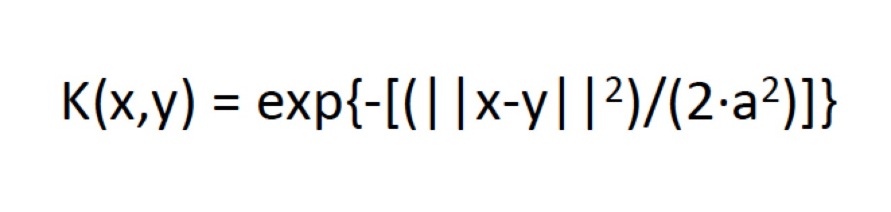

Sigmoid核

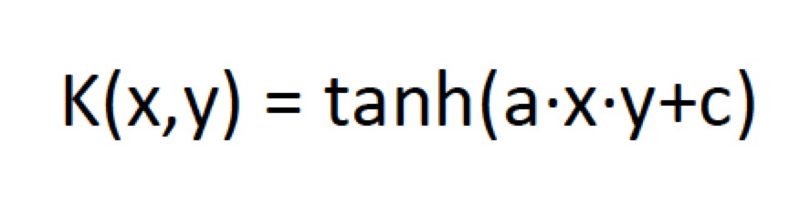

字符串核函数

## 补充：

### 拉格朗日对偶性（Lagrange duality ）

将原始问题转换成为对偶问题

#### 1. 原始问题

假设$f(x), c_i(x),h_i(x)$ 是定义在 $R^n$上的连续可微函数。

考虑约束最优化问题：
$$
\min_{x\in R^n} f(x)\\
s.t. \quad c_i(x)\geq0, \quad i=1,2,...k\\
h_i(x)=0, \quad j=1,2,..l
$$
称此约束最优化问题为原始最优化问题或原始问题。

首先引入广义拉格朗日函数（generalized Lagrange function）
$$
L(x,\alpha,\beta)=f(x)+\sum_{i=1}^k{\alpha_ic_i(x)}+\sum_{j=1}^l{\beta_jh_j(x)}
$$
其中，$x=(x^1,x^2,...,x^n)^T \in R^n$, $\alpha_i,\beta_j$是拉格朗日乘子，$\alpha_i \geq 0$, 考虑x的函数：
$$
θ_P(x)=\max_{\alpha,\beta:\alpha_i\geq 0}\ L(x, \alpha, \beta)
$$
其中下标P表示原始问题。

假设给定某个x，如果 x 违反原始问题的约束条件，即存在某个 i 使得$c_i(w)\gt0$或者存在某个  j 使得$h_j(w)\neq0$, 那么就有
$$
θ_P(x) = \max_{\alpha,\beta:\alpha_i\geq 0} \Big[f(x) + \sum_{i=1}^k\alpha_ic_i(x) + \sum_{j=1}^l \beta_jh_j(x)\Big] = + \infty
$$
因为若某个 i 使约束$c_i(x)\gt0$, 则可令$\alpha_i\rightarrow + \infty$，若某个 j 使得$h_j(x)\neq0$, 则可令$\beta_j $ 使 $ \beta_jh_j(x)\rightarrow + \infty$，而将其余各$\alpha_i, \beta_j$ 均取值为0.

相反地，如果x满足约束条件式，则可知，$θ_P(x) =f(x)$ . 因此，
$$
θ_P(x) =\begin{cases} 
f(x),x满足原始问题约束
\\
+\infty, 其他 
\end{cases}
$$
所以如果考虑极小化问题
$$
\min_x\theta_P(x)=\min_x\max_{\alpha,\beta:\alpha_i\geq0}L(x,\alpha,\beta)
$$
它与原始最优化问题是等价的，即它们有相同的解。问题 $\min_x\max_{\alpha,\beta:\alpha\geq0}L(x,\alpha,\beta)$ 称为广义的拉格朗日函数的极小极大问题。这样，就把原始最优化问题转换为广义的拉格朗日函数的极小极大问题。定义原始问题的最优值
$$
p^*=\min_x\theta_p(x)
$$
为原始问题的值。

我们可以这样理解，拉格朗日函数相当于构造了一个含参函数，在满足约束条件的情况下，这个函数的值总是小于等于目标函数 f(x)。 而我们此时选取合适的参数 $\alpha、\beta$ 令该函数最大可使等号成立，即令 $f(x)L(x,\alpha,\beta) = f(x)$ ; 若不满足约束条件，则总存在 $\alpha、\beta$ 使得该函数趋向于 $+\infty$ . 这里的max就是选取参数α、β的过程。

#### 2. 对偶问题

定义
$$
\theta_D(\alpha,\beta)=\min_xL(x,\alpha,\beta)
$$
再考虑极大化 $\theta_D(\alpha,\beta)=\min_xL(x,\alpha,\beta)$ , 即
$$
\max_{\alpha,\beta:\alpha_i \geq0}\theta_D(\alpha,\beta)=\max_{\alpha,\beta:\alpha_i \geq0}\min_xL(x,\alpha,\beta)
$$
问题 $\max_{\alpha,\beta:\alpha \geq0}\min_xL(x,\alpha,\beta)$ 称为广义拉格朗日函数的极大极小问题。

可以将广义的拉格朗日函数的极大极小函数转换为约束最优化问题：
$$
\max_{\alpha,\beta:\alpha_i \geq0}\theta_D(\alpha,\beta)=\max_{\alpha,\beta:\alpha_i \geq0}\min_xL(x,\alpha,\beta)
\\
s.t. \quad \alpha\geq0,i=1,2,...,k
$$
称为原始问题的对偶问题。定义对偶问题的最优值
$$
d^*=\max_{\alpha,\beta:\alpha_i \geq0}\theta_D(\alpha,\beta)
$$
称为对偶问题的值。

#### 3. 原始问题与对偶问题的关系

##### 定理1

若原始问题和对偶问题都有最优值，则
$$
d^*=\max_{\alpha,\beta:\alpha_i \geq0}\min_xL(x,\alpha,\beta)\leq \min_x\max_{\alpha,\beta:\alpha_i\geq 0}\ L(x, \alpha, \beta)=p^*
$$

##### 推论1

设 $x^*$ 和 $\alpha^*, \beta^*$ 分别为原始问题和对偶问题的可行解，并且 $d^*=p^*$ , 则  $x^*$ 和 $\alpha^*, \beta^*$ 分别是原始问题和对偶问题的最优解。

##### 定理2

（Slater条件）

对于原始问题和对偶问题，假设函数f(x) 和 $c_i(x)$ 是凸函数， $h_i(x)$ 是仿射函数，并且假设不等式约束 $c_i(x)$ 是严格可行的，即存在x，对所有 i 有 $c_i(x)\lt 0 $  ，则存在  $x^*,\alpha^*, \beta^*$ ，使 $x^*$ 是原始问题的解， $\alpha^*, \beta^*$ 是对偶问题的解，并且
$$
d^*=p^*=L(x^*,\alpha^*, \beta^*)
$$

##### 定理3

对于原始问题和对偶问题，假设函数f(x) 和 $c_i(x)$ 是凸函数， $h_i(x)$ 是仿射函数，并且假设不等式约束 $c_i(x)$ 是严格可行的，则 $x^*$ 和 $\alpha^*, \beta^*$ 分别是原始问题和对偶问题的解的充分必要条件是 $x^*,\alpha^*, \beta^*$ 满足下面的KKT条件
$$
\bigtriangledown_xL(x^*,\alpha^*,\beta^*)=0
\\
\bigtriangledown_\alpha L(x^*,\alpha^*,\beta^*)=0
\\
\bigtriangledown_\beta L(x^*,\alpha^*,\beta^*)=0
\\
\begin{aligned}
\alpha_i^*c_i(x^*) = 0,\quad i=1,2,\dots,k
\\ 
c_i(x^*) \leq 0, \quad i=1,2,\dots,k
\\ 
\alpha_i^* \geq 0,\quad i=1,2,\dots,k
\\ 
h_j(x^*) = 0,\quad i=1,2,\dots,l\\
\end{aligned}
$$

其中， $\alpha_i^*c_i(x^*) = 0,\quad i=1,2,\dots,k$ 为KKT的对偶互补条件。由此可知，若 $\alpha_i^*\gt0,$ 则 $c_j(x^*)=0$ . 

##### 补充：

关于KKT 条件的理解：前面三个条件是对于各个变量的偏导数为0（这就解释了一开始为什么假设三个函数连续可微，如果不连续可微的话，这里的偏导数存不存在就不能保证），后面四个条件就是原始问题的约束条件以及拉格朗日乘子需要满足的约束。

对比原始问题，对偶问题是先固定α,β，求最优化x的解，再确定参数α,β； 
原始问题是先固定x，求最优化α,β的解，再确定x。

拉格朗日对偶性的求解分为两个步骤：

1. 把原始的约束问题通过拉格朗日函数转化为无约束问题。
2. 在满足KKT的条件下用求解对偶问题来代替求解原始问题，使得问题求解更加容易。

拉格朗日函数虽然一眼看去十分复杂，但是其实它是将所有的限定条件加上新引入的变量(拉格朗日乘子)构成了一个新的函数，这样就将限定条件转换为了未知变量。

总结一下原始问题和拉格朗日函数：从原始问题开始，通过拉格朗日函数重新定义一个无约束问题，这个无约束问题等价于原来的约束优化问题，从而将约束问题无约束化。也就是将d个变量和k个约束条件的最优化问题转换为d+k个变量的最优化问题。到此我们还是无法求解，我们需要将原始问题转换成对偶问题来求解。

若原始问题与对偶问题都有最优解，则
$$
d^*=\max_{\alpha,\beta:\alpha_i \geq0}\min_xL(x,\alpha,\beta)\leq \min_x\max_{\alpha,\beta:\alpha_i\geq 0}\ L(x, \alpha, \beta)=p^*
$$
这个性质便叫做弱对偶性（weak duality），对于所有优化问题都成立，即使原始问题非凸。

与弱对偶性相对应的有一个强对偶性（strong duality） ，强对偶即满足：
$$
d^*=p^*  
$$

强对偶是一个非常好的性质，因为在强对偶成立的情况下，可以通过求解对偶问题来得到原始问题的解，在 SVM 中就是这样做的。当然并不是所有的对偶问题都满足强对偶性 ，在 SVM 中是直接假定了强对偶性的成立，其实只要满足一些条件，强对偶性是成立的，比如说 Slater 条件与KKT条件。

总的来说就是说任何满足强对偶性的优化问题，只要其目标函数与约束函数可微，任一对原始问题与对偶问题的解都是满足 KKT 条件的。即满足强对偶性的优化问题中，若 $x^*$ 为原始问题的最优解，  $\alpha^*, \beta^*$  为对偶问题的最优解，则可得 $x^*,\alpha^*, \beta^*$  满足 KKT 条件。

对于一个约束优化问题，找到其对偶问题，当弱对偶成立时，可以得到原始问题的一个下界。而如果强对偶成立，则可以直接求解对偶问题来解决原始问题。 SVM 就是这样的。对偶问题由于性质良好一般比原始问题更容易求解，在 SVM 中通过引入对偶问题可以将问题表示成数据的内积形式从而使得 kernel trick 的应用更加自然）。

### **仿射函数**

$$
f(x)=Ax+b
$$

仿射函数就是一个线性函数，其输入是n维向量，参数 A可以是常数，也可以是m×n的矩阵，b可以是常数，也可以是m维的列向量，输出是一个m维的列向量。在几何上，仿射函数是一个线性空间到另一个线性空间的变换。

